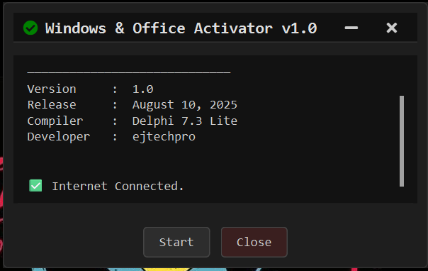

# Windows & Office Activator v1.0


A simple GUI tool to activate **Windows (< 8)** and **Microsoft Office** products.  
Built with **PySide6** and designed for lightweight activation tasks with an intuitive interface.

---

## Features

- Activates Windows versions older than 8.
- Activates Microsoft Office.
- Internet connection monitoring.
- Custom GUI with draggable frameless window.
- Detailed logs in the interface.
- Minimize and close buttons with a clean, modern title bar.

---

## Screenshots



---

## Installation

1. Make sure you have **Python 3.9+** installed.
2. Clone this repository:

```bash
git clone https://github.com/ejtechpro/windows-office-activator.git
cd windows-office-activator-tool
